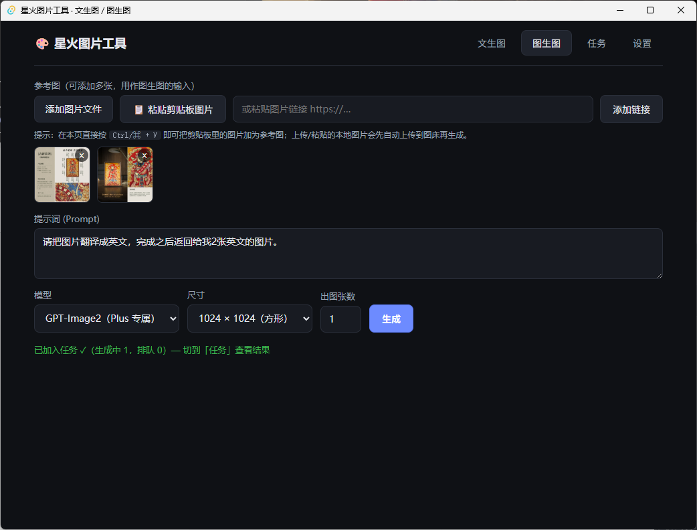
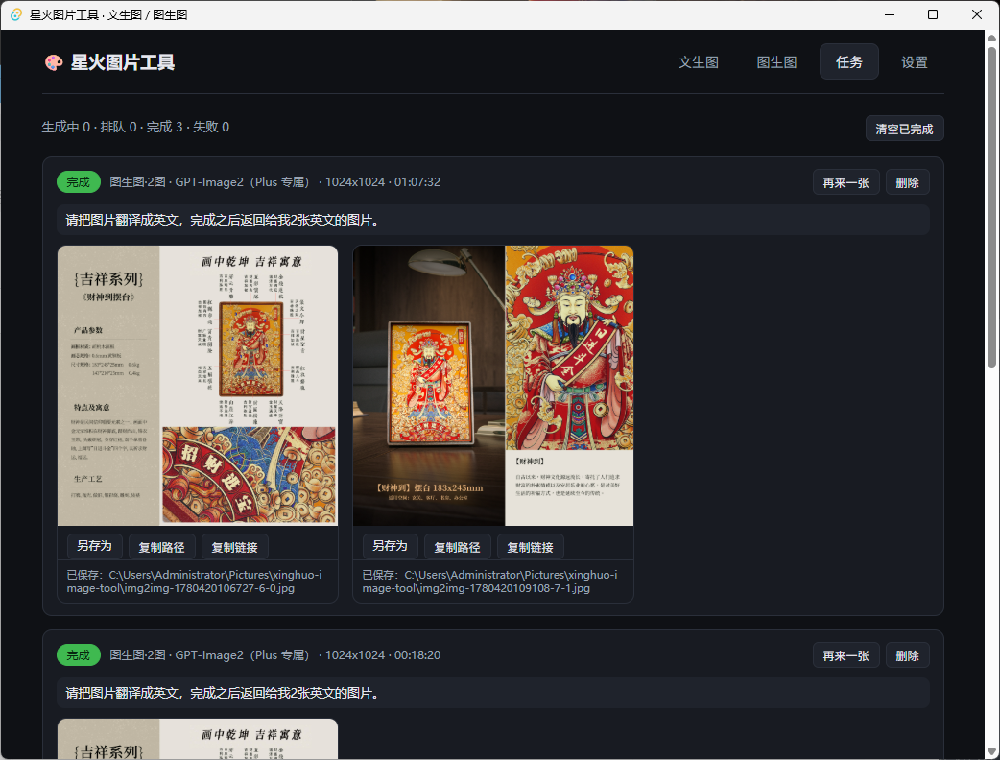

# 星火图片工具 (Xinghuo Image Tool)

一个基于 [Tauri 2](https://v2.tauri.app/) 的 Windows 桌面工具，调用 OpenAI 兼容的图片接口做**文生图 / 图生图**，结果自动保存到本地。

- 前端：TypeScript + Vite（无框架，纯原生 DOM）
- 后端：Rust（`reqwest` + `rustls`，所有 HTTP / 存图都在 Rust 端完成）

---

## 界面预览

**图生图：添加参考图 + 提示词，选「出图张数」后点生成**



**任务页：实时查看生成进度与结果，图片自动保存到本地**



---

## 功能

- **文生图**：输入提示词生成图片。
- **图生图**：添加参考图（文件 / 粘贴剪贴板 / 图片链接），按提示词改图、翻译图中文字等。
- **出图张数**：一次点击可生成 1~4 张（每张是一个独立任务，自动排队 / 并发）。
- **任务队列**：连续提交多个任务，并发数可调，实时显示「生成中 / 排队 / 完成 / 失败」。
- **自动保存**：生成的图片保存到 `图片(Pictures)/xinghuo-image-tool/`。
- **本地参考图自动上传**：本地 / 剪贴板图片会先上传到平台自带 OSS（`/api/v1/uploads/upload?public=true`）换成公网地址，供下游服务读取。

---

## 使用

打开应用后，先到 **设置** 填写：

| 项 | 说明 |
|---|---|
| 接口地址 (Base URL) | OpenAI 兼容服务地址，例如 `https://uuerqapsftez.sealosgzg.site` |
| API Key | 形如 `sk_xxx`，用 `Authorization: Bearer` 发送 |
| 等待超时（秒） | 单个请求最长等待，默认 600（10 分钟），图片生成较慢，建议别调太小 |
| 最大同时任务数 | 并发数，默认 3 |
| 图片上传地址 | **留空即用平台自带 OSS（推荐）**；填了才用自定义第三方图床 |

模型：

- `gpt-5-3` — GPT-Image（标准）
- `gpt-5-4-thinking` — GPT-Image2（Plus 专属）

填好后到「文生图 / 图生图」输入提示词，选「出图张数」，点 **生成**，到「任务」页查看结果。

---

## 开发运行

需要 [Node.js](https://nodejs.org/)、[Rust](https://rustup.rs/) 工具链，Windows 上还需 WebView2 运行时（Win10/11 一般自带）。

```bash
npm install
npx tauri dev      # 启动开发模式（首次会编译 Rust，需要几分钟）
```

改前端（`src/`）会热重载；改 Rust（`src-tauri/src/`）会自动重新编译重启。

---

## 打包

```bash
# 一键打两种产物（安装版 exe + 绿色免安装 zip）
package.bat
```

或手动：

```bash
npx tauri build
```

产物位置（`src-tauri/target/release/`）：

- **安装版 exe**：`bundle/nsis/XinghuoImageTool_<版本>_x64-setup.exe`
  双击安装，进开始菜单 / 桌面。
- **绿色免安装版**：`XinghuoImageTool.exe`（单文件，可直接运行）
  `package.bat` 会把它压缩成 `dist-portable/XinghuoImageTool-<版本>-portable-x64.zip`，解压即用、无需安装。

> 绿色版依赖系统的 **WebView2 运行时**（Windows 10/11 默认已装；老系统需先装一次 [WebView2 Runtime](https://developer.microsoft.com/microsoft-edge/webview2/)）。

---

## 关键技术说明（踩坑记录）

- **强制 HTTP/2（rustls）**：Windows 自带的 SChannel(native-tls) 在 ALPN 协商上不稳，常降级到 HTTP/1.1，而服务端网关会在约 120s 把空闲的 HTTP/1.1 长连接掐断。改用 `rustls` 可靠协商出 HTTP/2，配合 **HTTP/2 KeepAlive PING** 心跳，长达数分钟的生成请求不再被当成空闲连接断开。
- **账号错误自动重试**：服务端轮换 ChatGPT 账号，偶尔抽到 token 被吊销的账号会快速失败（`token_revoked`），客户端遇到这类临时错误会自动重试，重新抽号。
- **每请求独立连接**：禁用空闲连接池复用，避免并发长连接触发 rustls 的 TLS 状态问题。

---

## 目录结构

```
src/                 前端（TypeScript）
  main.ts            UI、任务队列、设置
src-tauri/           Rust 后端
  src/lib.rs         generate_images 命令：上传参考图、调用生成接口、存图
  tauri.conf.json    窗口 / 打包配置
package.bat          一键打包脚本（安装版 + 绿色版）
```
